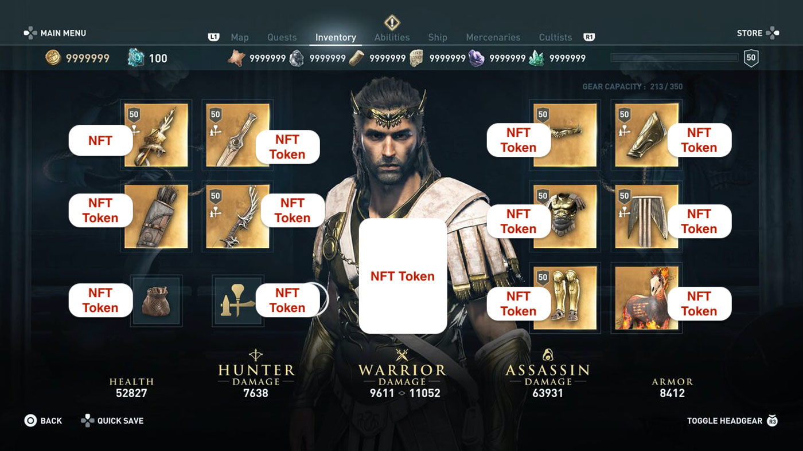
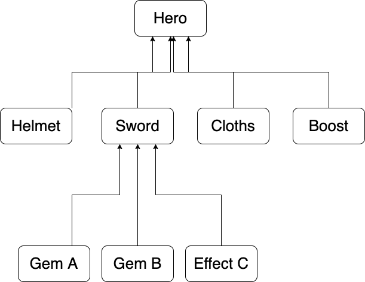

# Composable Token Contract

## Motivation

When we creating dapps or especially game on blockchain, we are getting familiar with non-fungible-tokens like pet, hero, monster... Each entity in game is designed as a NFT token

Everything work well until we need to create items system.

Items also are NFT tokens, and will be attached to hero in game.

The nightmare begin when we try to attach many items to a hero, likes sword, helmet, gloves, boosts... and with each items it may also has many other items attach on it, and of course, those can be any NFT or FT token, too.

So if we use NFT standalone, the attachment and detachment process, transfering items will become painful when the items system become large and complex with so many transactions required. The game performance may be broken.

That is the motivation for creating a new type of token - a **composable-token**, where any NFT token can be attached to or deteach from any NFT token at any time. Thus we can easily, automatically transfer whole heros along with all attached items in one transactions, or we can detach any items before send thoses.

## Composable tokens

A standard extension for any non-fungible token (NFT) to own another non-fungible ERC-721 token or fungible ERC-20 tokens. Transferring the token composition means transferring the entire hierarchy of items. Virtual assets can own their own assets. For example, a cryptokitty may own a scratching post and a feeding dish; the dish may contain some amount of fungible “chow” tokens. That’s one happy and well fed virtual cat.

One of the most interesting aspects of Cryptokitties was the breeding function. Composed assets can also be provided with actions based on “equipping” a child asset. Think of adding a food asset to a virtual character, like our kitty with chow tokens. Now the kitty can eat chow tokens and speed up their breeding rest period to become more valuable. A bit out of scope for this post would be a proposed standard for, “active assets”, allowing composable assets to act on other assets, their children or use a special action based on ownership of a child asset. What other games or business use cases could we serve with composable and actionable assets?

## Specification

- Composable token is a nft token, based on ERC721 token.
- Each token can have only one parent, and can have many childs.
- When attach token A to token B:
  - token A != token B
  - token B parent must different than token A to avoid recursion attachment.
  - token A and B both belongs to a same owner.
  - operator account also has permission to attach and detach token.
  - the actor of attach action must be the token owner or token owner's operator account.
  - update parent for token A, and childrens for token B.
- When detach token A from token B
  - token A must be attaching on token B.
  - the actor of attach action must be the token owner or token owner's operator account.
  - update parent for token A, and childrens for token B.

## Implementation

- Checkout [contract](contracts/composable-token.clar) for more information.

## Test

- Checkout [test-client](test/composable-token-client.test.ts) for more information about the client of composable token, which wrap all contract functions here, thus we can easily to call query or invoke transaction.

- Checkout [test-cases](test/composable-token.test.ts) for more information about test cases of composable token.

## License

