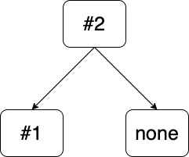
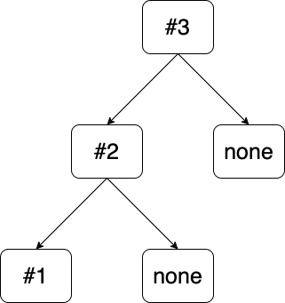
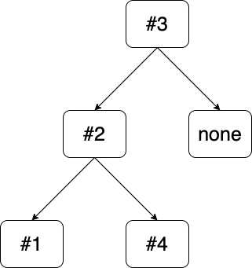
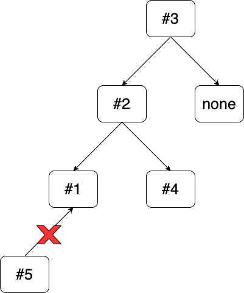
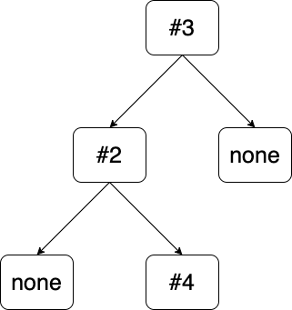
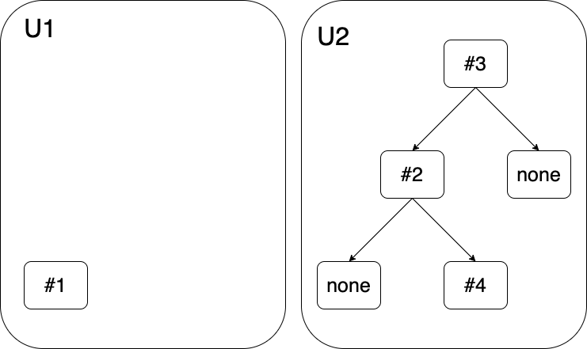
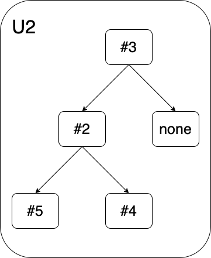
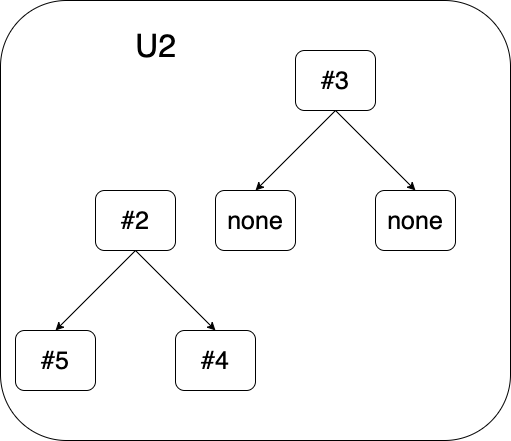

# Composable token test cases

## action by user U1

- each token has max 2 child
- each token has max 2 depth child (token -> child -> child-of-child)
- attach new token A to token B

  

  - token A is children of token B
  - token B is parent of token A
  - token B has 1 child
  - left child of token B is A
  - token A has 0 child
  - token A child depth is 0
  - token B child depth is 1

- attach token B to token A

  - not success because recursion attachment

- attach token B to token C

  

  - token B is child of token C
  - token C is parent of token B
  - token B has 1 child
  - left child of token C is B
  - token C has 1 child
  - token B child depth is 1
  - token C child depth is 2

- attach new token D to token B

  

  - token D is children of token B
  - token B is parent of token D
  - token B has 2 child
  - left child of token B is A
  - right child of token B is D
  - token D has 0 child
  - token D child depth is 0
  - token B child depth is 1
  - token C total depth child is 3

- attach token E to token A

  

  - not success because max child depth is 2, current relation is C -> B -> A

- detach token A from token B

  

  - token A has no parent
  - token B has 1 child
  - left child of token B is 0
  - right child of token B is D
  - token A has 0 child
  - token A child depth is 0
  - token B child depth is 1
  - token C child depth is 2

- transfer token C to new user U2

  

  - owner of C become U2
  - owner of B also become U2
  - owner of D also becomr U2
  - user U1 token count is decreased by 3
  - user U2 token count is increased by 3

- detach token D from token B
  - not success because token D and token B is no longer belongs to U1

## acion by user U2

- attach new token F to token B

  

  - token F is children of token B
  - token B is parent of token F
  - token F has 0 child
  - token B has 2 child
  - left child of token B is F
  - right child of token B is D
  - token F child depth is 0
  - token B child depth is 1
  - token C child depth count is 3

- detach token B from token C

  

  - token B has no parent
  - token B child depth is 1
  - token C child depth is 0
  - token C child count is 0

- attach token A to token D
  - not success because token A is not owned by U2
